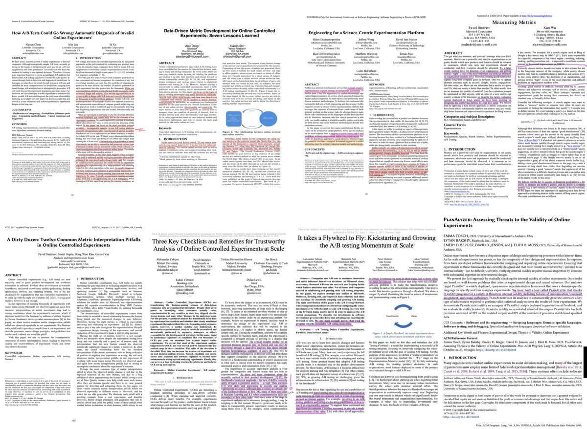

# Experimentation resources :pencil:

     
    
     

## Books

| Title                                                        | Link                                                         |
| ------------------------------------------------------------ | ------------------------------------------------------------ |
| Kohavi, R., Tang, D. and Xu, Y., 2020. **Trustworthy online controlled experiments: A practical guide to a/b testing.** Cambridge University Press. | [[link](https://www.amazon.com/Trustworthy-Online-Controlled-Experiments-Practical/dp/1108724264)] |
| Fabijan, Alexander PhD Thesis “**Data-Driven Software Development at Large Scale: from Ad-Hoc Data Collection to Trustworthy Experimentation**”. | [[link](http://www.diva-portal.org/smash/record.jsf?pid=diva2%3A1404709&dswid=-429)] |
| Georgiev, G., 2019, **Statistical Methods in Online A/B Testing: Statistics for data-driven business decisions and risk management in e-commerce** | [[link](https://www.amazon.de/-/en/gp/product/1694079724/ref=ppx_yo_dt_b_asin_title_o00_s00?ie=UTF8&psc=1)] |

## Articles

| Title                                                        | Link                                                         |
| ------------------------------------------------------------ | ------------------------------------------------------------ |
| Fabijan, A., ExP, E.P., Arai, B., Dmitriev, P. and Vermeer, L., **It takes a Flywheel to Fly: Kickstarting and Growing the A/B testing Momentum at Scale.** | [[link](https://www.researchgate.net/publication/353954101_It_takes_a_Flywheel_to_Fly_Kickstarting_and_Growing_the_AB_testing_Momentum_at_Scale)] |
| Gupta, S., Kohavi, R., Tang, D., Xu, Y., Andersen, R., Bakshy, E., Cardin, N., Chandran, S., Chen, N., Coey, D. and Curtis, M., 2019. **Top challenges from the first practical online controlled experiments summit**. ACM SIGKDD Explorations Newsletter, 21(1), pp.20-35. | [[link](https://research.fb.com/wp-content/uploads/2019/06/Top-Challenges-from-the-first-Practical-Online-Controlled-Experiments-Summit.pdf)] |
| Fabijan, A., Dmitriev, P., Olsson, H.H., Bosch, J., Vermeer, L. and Lewis, D., 2019, May. **Three key checklists and remedies for trustworthy analysis of online controlled experiments at scale.** In 2019 IEEE/ACM 41st International Conference on Software Engineering: Software Engineering in Practice (ICSE-SEIP) (pp. 1-10). IEEE. | [[link](https://dl.acm.org/doi/10.1109/ICSE-SEIP.2019.00009)] |
| Fabijan, A., Gupchup, J., Gupta, S., Omhover, J., Qin, W., Vermeer, L. and Dmitriev, P., 2019, July. **Diagnosing sample ratio mismatch in online controlled experiments: a taxonomy and rules of thumb for practitioners**. In Proceedings of the 25th ACM SIGKDD International Conference on Knowledge Discovery & Data Mining (pp. 2156-2164) | [[link](https://exp-platform.com/Documents/2019_KDDFabijanGupchupFuptaOmhoverVermeerDmitriev.pdf)] |
| Shi, X., Dmitriev, P., Gupta, S. and Fu, X., 2019, July. **Challenges, best practices and pitfalls in evaluating results of online controlled experiments**. In Proceedings of the 25th ACM SIGKDD International Conference on Knowledge Discovery & Data Mining (pp. 3189-3190). | [[link](https://dl.acm.org/doi/abs/10.1145/3292500.3332297)] |
| Fabijan, A., Dmitriev, P., McFarland, C., Vermeer, L., Holmström Olsson, H. and Bosch, J., 2018. **Experimentation growth: Evolving trustworthy A/B testing capabilities in online software companies.** Journal of Software: Evolution and Process, 30(12), p.e2113. | [[link](https://onlinelibrary.wiley.com/doi/abs/10.1002/smr.2113)] |
| Deng, A., Li, Y., Lu, J. and Ramamurthy, V., 2021. **On Post-selection Inference in A/B Testing**. | [[link](https://www.microsoft.com/en-us/research/uploads/prod/2021/06/PostSelectionKDD2021.pdf)] |
| Machmouchi, W., Awadallah, A.H., Zitouni, I. and Buscher, G., 2017, November. **Beyond success rate: Utility as a search quality metric for online experiments.** In Proceedings of the 2017 ACM on Conference on Information and Knowledge Management (pp. 757-765). | [[link](https://dl.acm.org/doi/10.1145/3132847.3132850)]     |
| Hohnhold, H., O'Brien, D. and Tang, D., 2015, August. **Focusing on the Long-term: It's Good for Users and Business**. In Proceedings of the 21th ACM SIGKDD International Conference on Knowledge Discovery and Data Mining (pp. 1849-1858). | [[link](https://research.google/pubs/pub43887/)]             |
| Tang, D., Agarwal, A., O'Brien, D. and Meyer, M., 2010, July. **Overlapping experiment infrastructure: More, better, faster experimentation**. In Proceedings of the 16th ACM SIGKDD international conference on Knowledge discovery and data mining (pp. 17-26). | [[link](https://static.googleusercontent.com/media/research.google.com/en//pubs/archive/36500.pdf)] |
| Duan, W., Ba, S. and Zhang, C., 2021, March. **Online Experimentation with Surrogate Metrics: Guidelines and a Case Study.** In Proceedings of the 14th ACM International Conference on Web Search and Data Mining (pp. 193-201). | [[link](https://dl.acm.org/doi/abs/10.1145/3437963.3441737)] |
| Xu, Ya, et al. "**From infrastructure to culture: A/b testing challenges in large scale social networks.**" Proceedings of the 21th ACM SIGKDD International Conference on Knowledge Discovery and Data Mining. 2015. | [[pdf](https://content.linkedin.com/content/dam/engineering/site-assets/pdfs/ABTestingSocialNetwork_share.pdf)] |
| Chen, N., Liu, M. and Xu, Y., 2019, January. **How A/B tests could go wrong: Automatic diagnosis of invalid online experiments.** In Proceedings of the Twelfth ACM International Conference on Web Search and Data Mining (pp. 501-509). | [[link](https://dl.acm.org/doi/10.1145/3289600.3291000)]     |
| Xu, Y., Duan, W. and Huang, S., 2018, July. **SQR: balancing speed, quality and risk in online experiments**. In Proceedings of the 24th ACM SIGKDD International Conference on Knowledge Discovery & Data Mining (pp. 895-904). | [[link](https://www.kdd.org/kdd2018/accepted-papers/view/sqr-balancing-speed-quality-and-risk-in-online-experiments)] |
| Chen, N., Liu, M. and Xu, Y., 2018. **Automatic Detection and Diagnosis of Biased Online Experiments.** arXiv preprint arXiv:1808.00114 | [[link](https://arxiv.org/abs/1808.00114)]                   |
| Sadeghi, S., Gupta, S., Gramatovici, S., Lu, J., Ai, H. and Zhang, R., 2021. **Novelty and Primacy: A Long-Term Estimator for Online Experiments**. arXiv preprint arXiv:2102.12893. | [[link](https://arxiv.org/abs/2102.12893)]                   |
| Gupta, Somit, et al. "**The anatomy of a large-scale experimentation platform.**" 2018 IEEE International Conference on Software Architecture (ICSA). IEEE, 2018. | [[link](https://ieeexplore.ieee.org/abstract/document/8417111/authors#authors)] |
| Fabijan, Aleksander, et al. "**Online controlled experimentation at scale: an empirical survey on the current state of A/B testing.**" 2018 44th Euromicro Conference on Software Engineering and Advanced Applications (SEAA). IEEE, 2018. | [[link](https://ieeexplore.ieee.org/abstract/document/8498188)] |
| Fabijan, Aleksander, et al. "**Effective online controlled experiment analysis at large scale.**" 2018 44th Euromicro Conference on Software Engineering and Advanced Applications (SEAA). IEEE, 2018. | [[link](https://ieeexplore.ieee.org/document/8498187)]       |
| Fabijan, Aleksander, et al. "**The evolution of continuous experimentation in software product development: from data to a data-driven organization at scale.**" 2017 IEEE/ACM 39th International Conference on Software Engineering (ICSE). IEEE, 2017. | [[link](https://0-ieeexplore-ieee-org.pugwash.lib.warwick.ac.uk/document/7985712)] |
| Deng, A., Xu, Y., Kohavi, R. and Walker, T., 2013, February. **Improving the sensitivity of online controlled experiments by utilizing pre-experiment data**. In Proceedings of the sixth ACM international conference on Web search and data mining (pp. 123-132). |                                                              |
| Deng, A. and Shi, X., 2016, August. **Data-driven metric development for online controlled experiments: Seven lessons learned.** In Proceedings of the 22nd ACM SIGKDD International Conference on Knowledge Discovery and Data Mining (pp. 77-86). |                                                              |
| Kohavi, R., Deng, A., Longbotham, R. and Xu, Y., 2014, August. **Seven rules of thumb for web site experimenters.** In Proceedings of the 20th ACM SIGKDD international conference on Knowledge discovery and data mining (pp. 1857-1866). |                                                              |
| Deng, A., Li, T. and Guo, Y., 2014, April. **Statistical inference in two-stage online controlled experiments with treatment selection and validation**. In Proceedings of the 23rd international conference on World Wide Web (pp. 609-618). |                                                              |
| Kohavi, R., Deng, A., Frasca, B., Longbotham, R., Walker, T. and Xu, Y., 2012, August. **Trustworthy online controlled experiments: Five puzzling outcomes explained**. Proceedings of the 18th ACM SIGKDD international conference on Knowledge discovery and data mining (pp. 786-794). |                                                              |
| Gupchup, J., Hosseinkashi, Y., Dmitriev, P., Schneider, D., Cutler, R., Jefremov, A. and Ellis, M., 2018, October. **Trustworthy experimentation under telemetry loss.** In Proceedings of the 27th ACM International Conference on Information and Knowledge Management (pp. 387-396). | [[link](https://arxiv.org/abs/1903.12470)]                   |
| Kohavi, R., Crook, T., Longbotham, R., Frasca, B., Henne, R., Ferres, J.L. and Melamed, T., 2009. **Online experimentation at Microsoft**. Data Mining Case Studies, 11(2009), p.39. | [[link](https://ai.stanford.edu/~ronnyk/ExPThinkWeek2009Public.pdf)] |
| Dmitriev, P., Gupta, S., Kim, D.W. and Vaz, G., 2017, August. **A dirty dozen: twelve common metric interpretation pitfalls in online controlled experiments.** In Proceedings of the 23rd ACM SIGKDD international conference on knowledge discovery and data mining (pp. 1427-1436). | [[link](https://dl.acm.org/doi/10.1145/3097983.3098024)]     |
| Xia, T., Bhardwaj, S., Dmitriev, P. and Fabijan, A., 2019, May. **Safe velocity: a practical guide to software deployment at scale using controlled rollout.** In 2019 IEEE/ACM 41st International Conference on Software Engineering: Software Engineering in Practice (ICSE-SEIP) (pp. 11-20). IEEE. | [[link](https://ieeexplore.ieee.org/document/8804449)]       |
| Wang, Y., Gupta, S., Lu, J., Mahmoudzadeh, A. and Liu, S., 2019, November. **On heavy-user bias in a/b testing**. In Proceedings of the 28th ACM International Conference on Information and Knowledge Management (pp. 2425-2428). | [[link](https://dl.acm.org/doi/pdf/10.1145/3357384.3358143)] |
| Xia, T., Bhardwaj, S., Dmitriev, P. and Fabijan, A., 2019, May. **Safe velocity: a practical guide to software deployment at scale using controlled rollout.** In 2019 IEEE/ACM 41st International Conference on Software Engineering: Software Engineering in Practice (ICSE-SEIP) (pp. 11-20). IEEE. | [[link](https://www.microsoft.com/en-us/research/publication/safe-velocity-a-practical-guide-to-software-deployment-at-scale-using-controlled-rollout/)] |
| Machmouchi, W. and Buscher, G., 2016, July. **Principles for the design of online A/B metrics**. In Proceedings of the 39th International ACM SIGIR conference on Research and Development in Information Retrieval (pp. 589-590). | [[link](https://dl.acm.org/doi/10.1145/2911451.2926731)]     |
| Lu, J., Qiu, Y. and Deng, A., 2019. **A note on Type S/M errors in hypothesis testing.** British Journal of Mathematical and Statistical Psychology, 72(1), pp.1-17. | [[link](https://bpspsychub.onlinelibrary.wiley.com/doi/abs/10.1111/bmsp.12132)] |
| Deng, A., Knoblich, U. and Lu, J., 2018, July. **Applying the Delta method in metric analytics: A practical guide with novel ideas.** In Proceedings of the 24th ACM SIGKDD International Conference on Knowledge Discovery & Data Mining (pp. 233-242). | [[link](https://dl.acm.org/doi/10.1145/3219819.3219919)]     |
| Mattos, D.I., Dmitriev, P., Fabijan, A., Bosch, J. and Olsson, H.H., 2018, November. **An activity and metric model for online controlled experiments**. In International Conference on Product-Focused Software Process Improvement (pp. 182-198). Springer, Cham. | [[link]](https://www.diva-portal.org/smash/get/diva2:1409540/FULLTEXT01.pdf) |
| Fabijan, A., Dmitriev, P., Olsson, H.H. and Bosch, J., 2017, August. **The benefits of controlled experimentation at scale**. In 2017 43rd Euromicro Conference on Software Engineering and Advanced Applications (SEAA) (pp. 18-26). IEEE. | [[link]](https://www.wikidata.ca/docs/Fabijan, A_Dmitriev, P_etal - The benefits of controlled experimentation at scale - 2017.pdf) |
| Diamantopoulos, Nikos, et al. "**Engineering for a science-centric experimentation platform.**" Proceedings of the ACM/IEEE 42nd International Conference on Software Engineering: Software Engineering in Practice. 2020. | [[link]](https://dl.acm.org/doi/abs/10.1145/3377813.3381349) |
| Forsell, Eskil, et al. "**Success Stories from a Democratized Experimentation Platform.**" arXiv preprint arXiv:2012.10403 (2020). | [[link](https://arxiv.org/abs/2012.10403)]                   |
| Xie, H. and Aurisset, J., 2016, August. **Improving the sensitivity of online controlled experiments: Case studies at netflix.** In Proceedings of the 22nd ACM SIGKDD International Conference on Knowledge Discovery and Data Mining (pp. 645-654). | [[link](https://www.kdd.org/kdd2016/papers/files/adp0945-xieA.pdf)] |
| Lopez Kaufman, Raphael, Jegar Pitchforth, and Lukas Vermeer. "**Democratizing online controlled experiments at Booking. com.**" arXiv e-prints (2017): arXiv-1710. | [[link](https://arxiv.org/abs/1710.08217)] [[video](https://vimeo.com/271252248)] |
| Kluck, T. and Vermeer, L., 2017. **Leaky Abstraction In Online Experimentation Platforms: A Conceptual Framework To Categorize Common Challenges**. arXiv preprint arXiv:1710.00397. | [[link](https://arxiv.org/abs/1710.00397)] [[post](https://www.lukasvermeer.nl/publications/2019/01/09/leaky-abstractions-in-online-experimentation-platforms.html)] |
| Öztan, B.T., van Havre, Z., Gomes, C. and Vermeer, L., 2018. **Mediation Analysis in Online Experiments at Booking. com: Disentangling Direct and Indirect Effects.** arXiv preprint arXiv:1810.12718. | [[link](https://arxiv.org/abs/1810.12718)]                   |
| Karrer, Brian, et al. "**Network experimentation at scale.**" arXiv preprint arXiv:2012.08591 (2020). | [[link](https://arxiv.org/abs/2012.08591)]                   |
| Tosch, Emma, et al. "**PlanAlyzer: assessing threats to the validity of online experiments.**" Proceedings of the ACM on Programming Languages 3.OOPSLA (2019): 1-30. | [[link](https://dl.acm.org/doi/pdf/10.1145/3360608)]         |
| Bakshy, E. and Frachtenberg, E., 2015, May. **Design and analysis of benchmarking experiments for distributed internet services.** In Proceedings of the 24th International Conference on World Wide Web (pp. 108-118). |                                                              |
| Bakshy, E., Eckles, D. and Bernstein, M.S., 2014, April. **Designing and deploying online field experiments.** In Proceedings of the 23rd international conference on World wide web (pp. 283-292). | [[link](https://arxiv.org/abs/1409.3174)]                    |
| Zhao, Z., Chen, M., Matheson, D. and Stone, M., 2016, October. **Online experimentation diagnosis and troubleshooting beyond aa validation**. In 2016 IEEE International Conference on Data Science and Advanced Analytics (DSAA) (pp. 498-507). IEEE. | [[link](https://ieeexplore.ieee.org/abstract/document/7796936/authors#authors)] |
| Drutsa, A., Gusev, G. and Serdyukov, P., 2015, May. **Future user engagement prediction and its application to improve the sensitivity of online experiments.** In Proceedings of the 24th International Conference on World Wide Web (pp. 256-266). | [[link](https://citeseerx.ist.psu.edu/viewdoc/download?doi=10.1.1.695.8084&rep=rep1&type=pdf)] |
| Kharitonov, E., Vorobev, A., Macdonald, C., Serdyukov, P. and Ounis, I., 2015, August. **Sequential testing for early stopping of online experiments.** In Proceedings of the 38th International ACM SIGIR Conference on Research and Development in Information Retrieval (pp. 473-482). | [[link](http://eprints.gla.ac.uk/105812/1/105812.pdf)]       |
| Kharitonov, E., Macdonald, C., Serdyukov, P. and Ounis, I., 2015, August. **Optimised scheduling of online experiments.** In Proceedings of the 38th International ACM SIGIR Conference on Research and Development in Information Retrieval (pp. 453-462). | [[link](http://eprints.gla.ac.uk/105811/1/105811.pdf)]       |
| Budylin, R., Drutsa, A., Katsev, I. and Tsoy, V., 2018, February. **Consistent transformation of ratio metrics for efficient online controlled experiments.** In Proceedings of the Eleventh ACM International Conference on Web Search and Data Mining (pp. 55-63). | [[link](https://www.researchgate.net/profile/Roman-Budylin/publication/322969314_Consistent_Transformation_of_Ratio_Metrics_for_Efficient_Online_Controlled_Experiments/links/5b054bbb45851588c6d4a1aa/Consistent-Transformation-of-Ratio-Metrics-for-Efficient-Online-Controlled-Experiments.pdf)] |
| Budylin, R., Drutsa, A., Gusev, G., Serdyukov, P. and Yashkov, I., 2018. **Online evaluation for effective web service development.** arXiv preprint arXiv:1809.00661. | [[link](https://arxiv.org/pdf/1809.00661.pdf)]               |
| Lindon, M. and Malek, A., 2020. **Sequential Testing of Multinomial Hypotheses with Applications to Detecting Implementation Errors and Missing Data in Randomized Experiments.** arXiv preprint arXiv:2011.03567. | [[link](https://arxiv.org/abs/2011.03567)] [[post](https://medium.com/engineers-optimizely/a-better-way-to-test-for-sample-ratio-mismatches-srms-and-validate-experiment-implementations-6da7c0d64552)] |
| Johari, R., Koomen, P., Pekelis, L. and Walsh, D., 2017, August. **Peeking at a/b tests: Why it matters, and what to do about it.** In *Proceedings of the 23rd ACM SIGKDD International Conference on Knowledge Discovery and Data Mining* (pp. 1517-1525). | [[link](https://dl.acm.org/doi/pdf/10.1145/3097983.3097992?casa_token=k4Gk1vH7p-4AAAAA:NVNucaD2ZzmNM2HLviUNpW_kaDUd56CkdzKOi9e51Kizs3pbsFM-07Olyo_LbHI-IjDH4R7DzzrvjSQ)] |
| Ha-Thuc, V., Dutta, A., Mao, R., Wood, M. and Liu, Y., 2020, July. **A counterfactual framework for seller-side a/b testing on marketplaces.** In *Proceedings of the 43rd International ACM SIGIR Conference on Research and Development in Information Retrieval* (pp. 2288-2296). | [[link](https://research.fb.com/publications/a-counterfactual-framework-for-seller-side-a-b-testing-on-marketplaces/)] |
| Liu, M., Mao, J. and Kang, K., 2021, August. **Trustworthy and Powerful Online Marketplace Experimentation with Budget-split Design.** In *Proceedings of the 27th ACM SIGKDD Conference on Knowledge Discovery & Data Mining* (pp. 3319-3329). | [[link](https://dl.acm.org/doi/pdf/10.1145/3447548.3467193?casa_token=NXEgdCptuMYAAAAA:Me5ynbm81ugAxIWFGhJPhnTT0ySsbzOIDe0cGXtzvoJ3TDG-d9vx2xDCMrH-r1aOyY7bdd_B6l0vwjY)] |
| Nandy, P., Venugopalan, D., Lo, C. and Chatterjee, S., 2021. **A/B Testing for Recommender Systems in a Two-sided Marketplace.** arXiv preprint arXiv:2106.00762. | [[link](https://arxiv.org/pdf/2106.00762.pdf)]               |

## Blog posts & other

| **Title**                                                    | **Link**                                                     |
| ------------------------------------------------------------ | ------------------------------------------------------------ |
| Thomke, Stefan. "**Building a culture of experimentation.**" Harvard Business Review 98.2 (2020): 40-47. | [[link](https://hbr.org/2020/03/building-a-culture-of-experimentation)] |
| **Experiment reporting framework**, Airbnb                   | [[link](https://medium.com/airbnb-engineering/experiment-reporting-framework-4e3fcd29e6c0#.j5wtjdy0p)] |
| **Why we use experimentation quality as the main KPI for our experimentation platform**, Booking | [[link](https://medium.com/booking-product/why-we-use-experimentation-quality-as-the-main-kpi-for-our-experimentation-platform-f4c1ce381b81)] |
| **How We Reimagined AB Testing at Squarespace**              | [[link](https://engineering.squarespace.com/blog/2021/how-we-reimagined-ab-testing-at-squarespace)] |
| **How Etsy Handles Peeking in A/B tests**                    | [[link](https://codeascraft.com/2018/10/03/how-etsy-handles-peeking-in-a-b-testing/)] |
| **Interview with Experimentation Lead: Andre Richter at Just Eat Takeaway.com** | [[link](https://www.awa-digital.com/blog/interview-with-head-of-experimentation-andre-richter-at-just-eat-takeaway-com/)] |
| **Our evolution towards T-REX: The prehistory of experimentation infrastructure at LinkedIn** | [[link](https://engineering.linkedin.com/blog/2020/our-evolution-towards-t-rex--the-prehistory-of-experimentation-i)] |
| **Making the LinkedIn experimentation engine 20x faster**, LinkedIn | [[link](https://engineering.linkedin.com/blog/2020/making-the-linkedin-experimentation-engine-20x-faster)] |
| **Designing an Experimentation Platform**, Zalando           | [[podcast](https://www.remerge.io/findings/podcast/designing-an-experimentation-platform-zalando)] |
| **AB testing at Zalando: concepts and tools**                | [[video](https://www.youtube.com/watch?v=wmEAUfkLk50)]       |
| **Experimentation Platform at Zalando: Part 1 - Evolution**  | [[link](https://engineering.zalando.com/posts/2021/01/experimentation-platform-part1.html)] |
| **A Conversation with Ronny Kohavi (ex-Airbnb, Microsoft, and Amazon)** | [[podcast](https://open.spotify.com/episode/4d3Prnlc0VIf6dQSdWdGmb)] |

